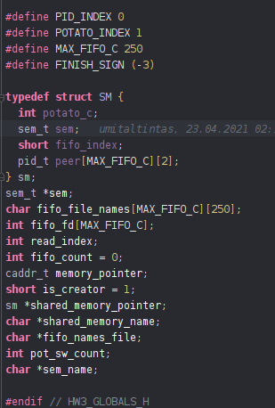
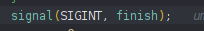
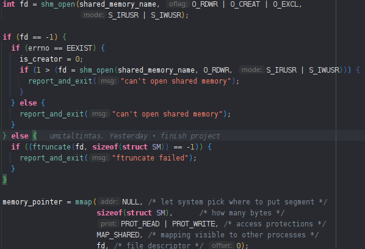
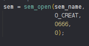
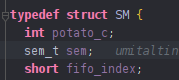
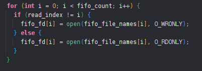
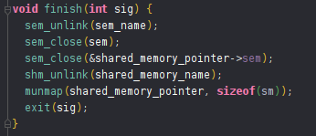

USAGE
=====

I got the command line arguments with getopt(), also I have moved the
usage print function to the usage.h header for further changing.

VARIABLES
=========

I have defined the main variables as global for easy memory management.
Moved them to the global header file.

 

SIGNAL
======

I have defined a finish function as a signal handler.

 

SHARED MEMORY
=============

First of all, I have tried to open file with EXCL flag so if it is
already exist return -1 if it is return -1 I have tried without EXCL
flag. With this return value have decided who will truncate it and
create default values of shared memory. Lastly, all processes write their
information to the shared memory. (potato sw number eg.)

 

SEMAPHORE
=========

I have used to semaphore for synchronization. One for deciding who take
which FIFO file and one for who will write to the shared memory

 

This semaphore used for selecting FIFO files. it starts with 0. after
the creator process creates fifoes it posts the semaphore. After that, they take
their fifo's respectively. For decision who takes which fifo I have used an
index inside the shared memory.



 

This semaphore decides who can change shared memories values.

FIFO
====

After creation fifos, they open their fifos as a reader and open others as
a writer. Also, fifo file names index and PID indexes(inside the shared
memory) are the same.

 

TRANSFER
========

At first, they wait for semaphore 2 for getting info’s from shared
memory. after that, if they check their potatoes switch number. if it is
not zero select a random FIFO and send its potato. After sending potato
post the semaphore and starts reading its FIFO. If they read the finish
signal they break the loop and call the finish function for memory
management, if it is read a valid potato, it waits for semaphore 2 for
changing shared memory. When taking permission it decreases the potato
switch number and checks the active potato switch number. If the switch number becomes 0 it decreases active potato count after that it checks active potato count also if it becomes 0 sends all fifos a finish signal which
is -3 in my case. All of the above is inside an infinite loop.

```c
while (true) {

    // write potato to fifo
    if (-1 == sem_wait(&shared_memory_pointer->sem)) {
      report_and_exit("sem_wait");
    }
    if (shared_memory_pointer->peer[potato_id][POTATO_INDEX]) {
      random_number = select_random_index();
      printf("pid=%d sending potato number %d to %s; %d switches left\n",
             getpid(), shared_memory_pointer->peer[potato_id][PID_INDEX],
             fifo_file_names[random_number],
             shared_memory_pointer->peer[potato_id][POTATO_INDEX] - 1);
      fflush(stdout);
      write(fifo_fd[random_number], &potato_id, sizeof(int));
    }
    if (-1 == sem_post(&shared_memory_pointer->sem)) {
      report_and_exit("sem_post");
    }

    // read potato from fifo
    read(fifo_fd[read_index], &potato_id, sizeof(int));
    if (potato_id == FINISH_SIGN) {
      break;
    } else {

      // update shared memory
      if (-1 == sem_wait(&shared_memory_pointer->sem)) {
        report_and_exit("sem_wait");
      }
      printf("pid=%d receiving potato number %d from %s\n", getpid(),
             shared_memory_pointer->peer[potato_id][PID_INDEX],
             fifo_file_names[read_index]);
      // update switch count
      shared_memory_pointer->peer[potato_id][POTATO_INDEX]--;

      // update potato count
      if (shared_memory_pointer->peer[potato_id][POTATO_INDEX] == 0) {
        printf("pid=%d; potato number %d has cooled down.\n", getpid(),
               shared_memory_pointer->peer[potato_id][PID_INDEX]);
        shared_memory_pointer->potato_c--;
      }
      // handle finish case
      if (shared_memory_pointer->potato_c == 0) {
        send_finish_sign();
        if (-1 == sem_post(&shared_memory_pointer->sem)) {
          report_and_exit("sem_post");
        }
        break;
      }
      if (-1 == sem_post(&shared_memory_pointer->sem)) {
        report_and_exit("sem_post");
```

MEMORY
======

Using the advantage of defining main variables as global. I can easily
free and close them with the finish function.



FILE STRUCTURE
==============

-src <br>
--globals.h<br>
--usage.h<br>
--usage.c<br>
--main.c <br>
-makefile<br>
-report.pdf<br>
